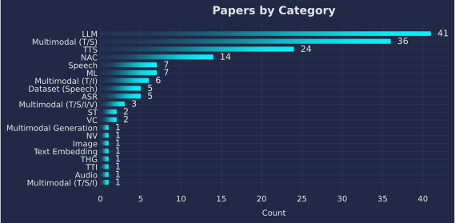
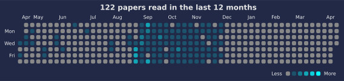

# 📚 Paper Reading Log

Track and visualize your paper reading with auto-updated charts.

<!--CHART_START-->





**Breakdown**

| Category | Count |
|---|---|
| LLM | 48 |
| Multimodal (T/S) | 41 |
| TTS | 25 |
| NAC | 14 |
| Speech | 8 |
| ASR | 7 |
| ML | 7 |
| Dataset (Speech) | 6 |
| Multimodal (T/I) | 6 |
| Multimodal (T/S/I/V) | 4 |
| Image | 2 |
| Multimodal (T/S/I) | 2 |
| ST | 2 |
| VC | 2 |
| Audio | 1 |
| Dataset (Audio) | 1 |
| Multimodal Generation | 1 |
| NV | 1 |
| Text Embedding | 1 |
| THG | 1 |
| TTI | 1 |
| **Total** | **181** |

**Recently read**

- [SAM 3D: 3Dfy Anything in Images](https://ai.meta.com/research/publications/sam-3d-3dfy-anything-in-images/) — *Image* (2025-11-21)
- [CASTELLA: Long Audio Dataset with Captions and Temporal Boundaries](https://arxiv.org/abs/2511.15131) — *Dataset (Audio)* (2025-11-20)
- [ParaS2S: Benchmarking and Aligning Spoken Language Models for Paralinguistic-aware Speech-to-Speech Interaction](https://arxiv.org/abs/2511.08723) — *Multimodal (T/S)* (2025-11-18)
- [Weight-sparse transformers have interpretable circuits](https://cdn.openai.com/pdf/41df8f28-d4ef-43e9-aed2-823f9393e470/circuit-sparsity-paper.pdf) — *LLM* (2025-11-17)
- [FaiST: A Benchmark Dataset for Fairness in Speech Technology](https://www.isca-archive.org/interspeech_2025/jahan25_interspeech.pdf) — *Dataset (Speech)* (2025-11-16)
- [Faster Cascades via Speculative Decoding](https://openreview.net/pdf?id=vo9t20wsmd) — *LLM* (2025-11-15)
- [Not All Tokens Are What You Need for Pretraining](https://openreview.net/pdf?id=0NMzBwqaAJ) — *LLM* (2025-11-14)
- [Omnilingual ASR: Open-Source Multilingual Speech Recognition for 1600+ Languages](https://ai.meta.com/research/publications/omnilingual-asr-open-source-multilingual-speech-recognition-for-1600-languages/) — *ASR* (2025-11-13)
- [Learning Dynamics of LLM Finetuning](https://openreview.net/pdf?id=tPNHOoZFl9) — *LLM* (2025-11-12)
- [Safety Alignment Should be Made More Than Just a Few Tokens Deep](https://openreview.net/pdf?id=6Mxhg9PtDE) — *LLM* (2025-11-10)
<!--CHART_END-->

## How to add a new paper

Add paper info to `data/papers.yml` in the following format:

```yaml
- title: "Your paper title"
  category: "LLM"
  date: "YYYY-MM-DD"
  link: "https://..."
```

## Reuse This Repo

- Use as template: Click "Use this template" on GitHub, then edit `data/papers.yml`.
- Timezone: Set `PAPERS_TZ` in the workflow (default `Asia/Tokyo`).
- CI validation: The workflow validates `data/papers.yml` before building charts.
- Export: CI also writes a machine-readable `data/papers.json` for reuse.

See `TEMPLATE.md` for details.

## Development

With `uv` (recommended):

```
uv sync
uv run scripts/validate_papers.py
uv run scripts/build_readme.py
uv run scripts/export_json.py
```

## License

- Code: MIT (`LICENSE`)
- Content (notes, `data/papers.yml`, generated charts in `assets/`): CC BY 4.0 — https://creativecommons.org/licenses/by/4.0/
