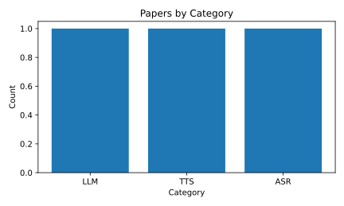

# 📚 Paper Reading Log

Automatically visualize your paper reading log below:

<!--CHART_START-->



**Breakdown**

| Category | Count |
|---|---|
| ASR | 1 |
| LLM | 1 |
| TTS | 1 |
| **Total** | **3** |

**Recently read**

- [Chain-of-Thought Reasoning Elicits...](https://arxiv.org/abs/xxxx.xxxx) — *LLM* (2023-05-10)
- [SpeechT5: Unified-Modal Encoder-Decoder...](https://arxiv.org/abs/xxxx.xxxx) — *ASR* (2022-02-14)
- [VITS: Conditional Variational...](https://arxiv.org/abs/xxxx.xxxx) — *TTS* (2021-06-01)
<!--CHART_END-->

## How to add a new paper

Add paper info to `data/papers.yml` in the following format:

```yaml
- title: "Your paper title"
  category: "LLM"
  date: "YYYY-MM-DD"
  link: "https://..."
```
