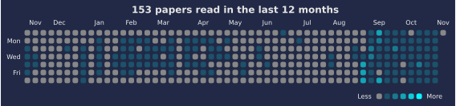

# 📚 Paper Reading Log

Automatically visualize your paper reading log below:

<!--CHART_START-->





**Breakdown**

| Category | Count |
|---|---|
| LLM | 8 |
| TTS | 4 |
| Multimodal (T/S) | 2 |
| Dataset (Speech) | 1 |
| Speech | 1 |
| THG | 1 |
| **Total** | **17** |

**Recently read**

- [Predicting the Order of Upcoming Tokens Improves Language Modeling](https://arxiv.org/abs/2508.19228) — *LLM* (2025-08-29)
- [LIST: Language-Independent Speech Token for Multilingual Speech Synthesis with Language Models](https://www.isca-archive.org/interspeech_2025/liu25o_interspeech.pdf) — *TTS* (2025-08-28)
- [OpusLM: A Family of Open Unified Speech Language Models](https://arxiv.org/abs/2506.17611) — *Multimodal (T/S)* (2025-08-28)
- [Scalable Spontaneous Speech Dataset (SSSD): Crowdsourcing Data Collection to Promote Dialogue Research](https://www.isca-archive.org/interspeech_2025/sheikh25_interspeech.pdf) — *Dataset (Speech)* (2025-08-27)
- [Qwen3: Think Deeper, Act Faster](https://qwenlm.github.io/blog/qwen3/) — *LLM* (2025-04-30)
- [ChatTS: Aligning Time Series with LLMs via Synthetic Data for Enhanced Understanding and Reasoning](https://arxiv.org/abs/2412.03104) — *LLM* (2025-04-28)
- [Context-aware Dynamic Pruning for Speech Foundation Models](https://openreview.net/forum?id=u2QdCiOgwA) — *Speech* (2025-04-23)
- [An Evolved Universal Transformer Memory](https://arxiv.org/abs/2410.13166) — *LLM* (2025-04-22)
- [AWQ: Activation-aware Weight Quantization for LLM Compression and Acceleration](https://arxiv.org/abs/2306.00978) — *LLM* (2025-04-18)
- [ALMTokenizer: A Low-bitrate and Semantic-rich Audio Codec Tokenizer for Audio Language Modeling](https://arxiv.org/abs/2504.10344) — *TTS* (2025-04-16)
<!--CHART_END-->

## How to add a new paper

Add paper info to `data/papers.yml` in the following format:

```yaml
- title: "Your paper title"
  category: "LLM"
  date: "YYYY-MM-DD"
  link: "https://..."
```
